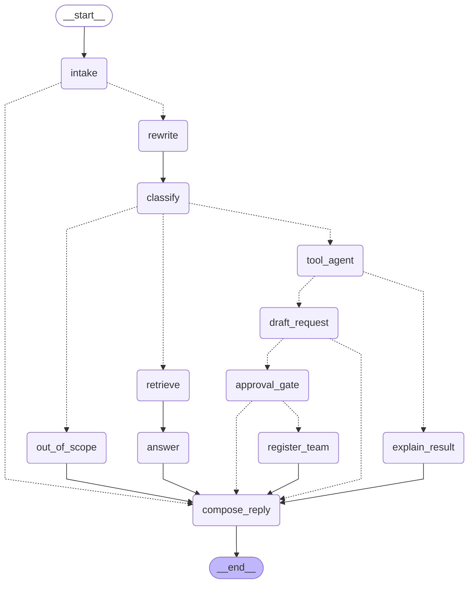

# FestGuide graph (generated by graph.py)

```mermaid
---
config:
  flowchart:
    curve: linear
---
graph TD;
	__start__([<p>__start__</p>]):::first
	intake(intake)
	rewrite(rewrite)
	classify(classify)
	retrieve(retrieve)
	answer(answer)
	tool_agent(tool_agent)
	explain_result(explain_result)
	draft_request(draft_request)
	approval_gate(approval_gate)
	register_team(register_team)
	out_of_scope(out_of_scope)
	compose_reply(compose_reply)
	__end__([<p>__end__</p>]):::last
	__start__ --> intake;
	answer --> compose_reply;
	approval_gate -.-> compose_reply;
	approval_gate -.-> register_team;
	classify -.-> out_of_scope;
	classify -.-> retrieve;
	classify -.-> tool_agent;
	draft_request -.-> approval_gate;
	draft_request -.-> compose_reply;
	explain_result --> compose_reply;
	intake -.-> compose_reply;
	intake -.-> rewrite;
	out_of_scope --> compose_reply;
	register_team --> compose_reply;
	retrieve --> answer;
	rewrite --> classify;
	tool_agent -.-> draft_request;
	tool_agent -.-> explain_result;
	compose_reply --> __end__;
	classDef default fill:#f2f0ff,line-height:1.2
	classDef first fill-opacity:0
	classDef last fill:#bfb6fc

```
